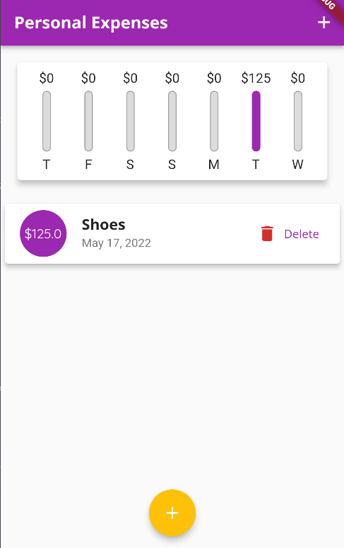

# Expense Tracker

---

## Simple Flutter App for tracking expenses

### Here is a preview:


---

### How to run?

1. ```  git clone https://github.com/NotSoYeezy/expense_tracker.git```
2. Open in VSCode
3. Run Flutter emulator
4. Start app in VSCode
